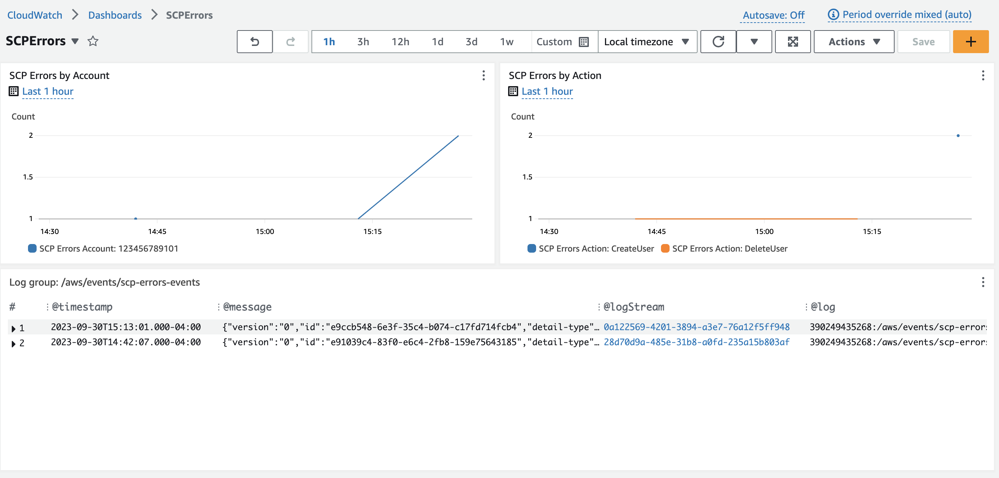

# Real-Time SCP Error Monitor

AWS Service Control Policies (SCPs) are a powerful cloud security tool, but they can have an expansive blast radius in large environments. While careful testing in QA and targeting smaller sets of OUs can reduce the rollout risk, SCPs do not have a dry-run or audit mode and therefore cannot be fully tested against the exact production environment until after they are applied. Many organizations rely on CloudTrail logs to monitor their SCP rollouts, but those logs can often be delayed over 15 minutes (a long time during a possible outage!).

This repo, "Safer SCPs," leverages AWS EventBridge to aggregate CloudTrail events from Organization member accounts in real-time. It uses an EventBridge rule pattern to match on the error message text "deny in a service control policy" and then routes matched events to an event bus in the Organization management account for observation.

This allows the user rolling out the SCP to live-tail the logs, watching for a possible spike in "Access Denied" errors caused by their SCP changes.



## Resources

This repo consists of two CloudFormation stacks:

1. `bus.yml` - Deployed to the Organization management account
2. `rules.yml` - Deployed to all (or applicable) member accounts via StackSets in the management account

### `bus.yml`
This stack set creates the following resources:
* CloudWatch log group, `/aws/events/scp-errors-events`
* CloudWatch log group metric filter, which splits the logs into two dimensions: `Account` (the AWS member account ID) and `Action` (the IAM action that was denied)
* Event bus, `scp-errors-event-bus`
* Event bus policy, which allows all member accounts in the Organization to send events to the bus
* Event bus rule, which sends the events to the CloudWatch log group target

The stack has an output, `EventBusArn` which is used as an input to the next stack.

### `rules.yml`
This stack creates the following resources:
* IAM role, used by the `events.amazonaws.com` service to send matched events to the event bus in the management account
* Event bus rule, which sends matching CloudTrail `AccessDenied` errors, where the error message ends in `deny in a service control policy` to the target event bus in the management account.

The event rule matches on CloudTrail events using the following pattern:
```
{
  "detail-type": ["AWS API Call via CloudTrail"],
  "detail": {
    "errorCode": ["AccessDenied"],
    "errorMessage": [{
      "suffix": "deny in a service control policy"
    }]
  }
}
```

## Prerequisites

1. You must have CloudTrail logging enabled in each of the member accounts.
2. The role used to deploy these stacks must have access to the management account.
3. The management account must be configured to enable StackSet deployments to the member accounts (alternatively, you can deploy the stack in the member account directly, but this is slower at scale).

## Deployment

1. Log into the management account with a role that has access to create CloudFormation, CloudWatch, and EventBridge resources.
2. Deploy the `bus.yml` stack
3. For the `OrgId` parameter, enter your Organization ID. This can be found on the [Organizations](https://us-east-1.console.aws.amazon.com/organizations/v2/home/) home page.
4. Once the stack completes, note the stack output, `EventBusArn`.
5. Launch a new StackSet using the `rules.yml` stack.
6. Provide the `EventBusArn` copied in step 4 as an input parameter.
7. You can choose to deploy the StackSet however you'd like (to all member accounts, only a few, all regions, only one region, in parallel, series, etc.)

Once the stack completes, your targeted member accounts will now begin sending their matching SCP "Access Denied" events to the `/aws/events/scp-errors-events` CloudWatch Log Group.

## Live Tailing Logs

1. Navigate to the [CloudWatch Logs Live Tail](https://us-east-1.console.aws.amazon.com/cloudwatch/home?region=us-east-1#logsV2:live-tail) page.
2. Select the log group `/aws/events/scp-error-events`.
3. Click "Start" to begin tailing.


Note: live tailing can be expensive! Be sure to stop the tail when you're done.

## CloudWatch Dashboard

You can also create a CloudWatch dashboard to visualize the SCP errors in real-time. The dashboard can be created in the management account.

1. Navigate to the [CloudWatch Dashboards](https://us-east-1.console.aws.amazon.com/cloudwatch/home?region=us-east-1#dashboards:) page.
2. Click "Create Dashboard"
3. Give the dashboard a name, such as "SCPErrors"
4. Click "Create Dashboard"
5. Click "Add widget"
6. Select "Logs Table" as the widget type
7. Select the log group `/aws/events/scp-error-events`
8. Click "Add widget"
9. Select "Metric" as the widget type
10. Select the "Line" type
11. Select the "ScpErrors" namespace
12. Select "Query" and enter the following:
  - Namespace: ScpErrors
  - Metric Name: COUNT(ScpErrors)
  - Group By: Account
13. Select the "Options" tab and change the Period to "30 seconds"
14. Enter a label, such as "SCP Errors Account:" 
15. Alternatively, enter the following in the "Source" tab:
```
{
    "metrics": [
        [ { "expression": "SELECT COUNT(ScpErrors) FROM ScpErrors GROUP BY Account", "label": "SCP Errors Account:", "id": "q1", "period": 30 } ]
    ],
    "view": "timeSeries",
    "stacked": false,
    "region": "us-east-1",
    "stat": "Average",
    "period": 30,
    "yAxis": {
        "left": {
            "showUnits": false,
            "label": "Count"
        }
    },
    "liveData": true
}
```
16. Duplicate the widget and change the "Group By" to "Action"


You can now edit the time range and enable auto-update to see the SCP errors in real-time.

## Cost Considerations

This solution is designed to be as cost-effective as possible. Assuming you do not have 100s of 1000s of SCP errors per month, the cost should be ~$0.

* The events logged in the member accounts are **free**, since they are AWS default service events.
* Matched events that are sent cross-account to the management account are charged at the standard EventBridge rate of **$1 per million events**.
* Events sent across regions may also incur data transfer costs.
* The CloudWatch log group is charged at the standard CloudWatch Logs rate of **$0.50 per GB**.

See [EventBridge Pricing](https://aws.amazon.com/eventbridge/pricing/) and [CloudWatch Logs Pricing](https://aws.amazon.com/cloudwatch/pricing/) for more information.